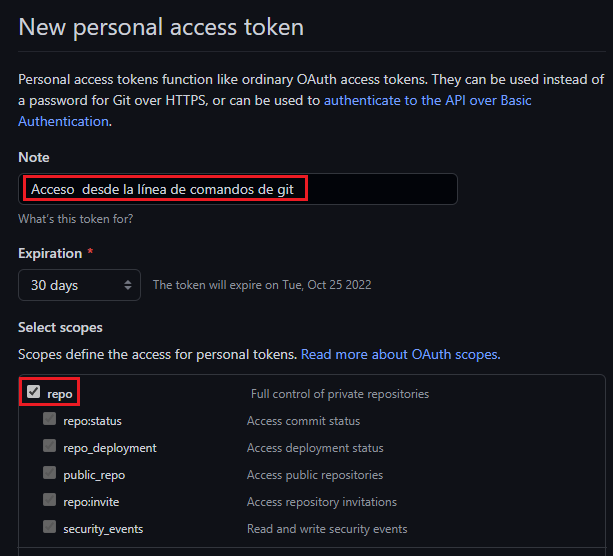
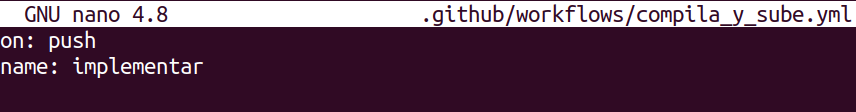
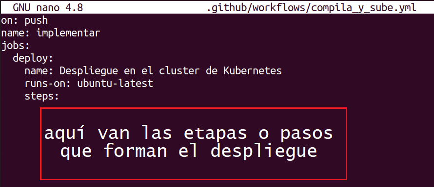
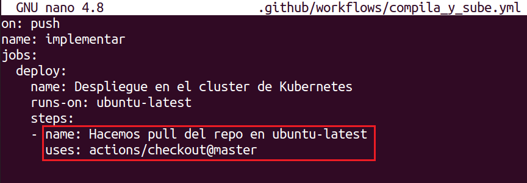
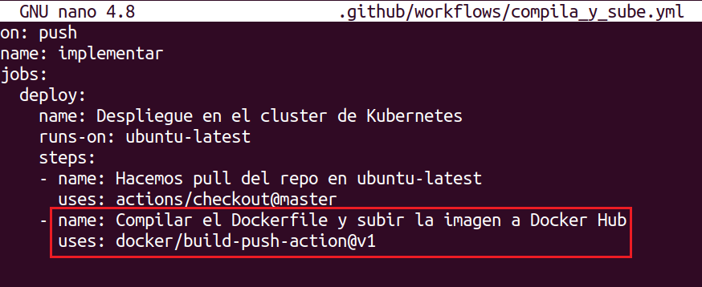
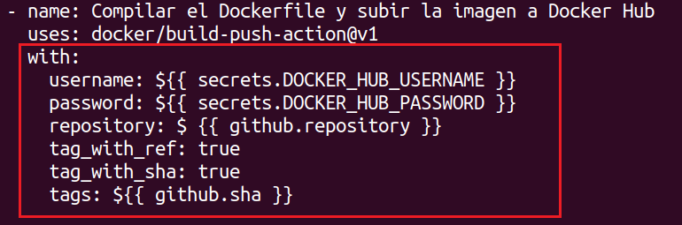

# CI-CD-Docker-GitHub-Actions-Kubernetes
Ejemplo de un CI/CD completo Github Actions.

Requisitos:

* Docker y Minikube instalados.


Este tutorial realiza un recorrido completo para desplegar un CI/CD básico desde un Archivo Dockerfile hasta el despliegue del deployment correspondiente en Kubernetes.

Para facilitar la práctica, clonamos el directorio que contiene este documento y el resto de archivos que necesitarás para realizar la práctica.

En la terminal ejecuta.
```
cd ~

git clone https://github.com/antsala/CI-CD-Docker-GitHub-Actions-Kubernetes.git
```


## Ejercicio 1: Crear un repositorio nuevo en ***Github*** y clonarlo.

En ***GitHub*** creamos un repositorio llamado ***CI-CD-Test***.
Nota: El nombre del repositorio puedes cambiarlo a tu gusto.
Nota: Si ya has realizado este laboratorio antes, elimina el repo y vuelve a crearlo desde cero.

En la terminal vamos a clonar el repositorio remoto.
Nota. Tendrás que poner la URL correcta de tu repositorio.
```
cd ~

git clone https://github.com/antsala/CI-CD-Test.git
```

Entramos en el directorio que se acaba de crear.
```
cd CI-CD-Test
```

Vamos a copiar algunos archivos necesarios desde el repositorio ***CI-CD-Docker-GitHub-Actions-Kubernetes*** a este directorio.
```
cp -r ~/CI-CD-Docker-GitHub-Actions-Kubernetes/helloContainer/ .

cp ~/CI-CD-Docker-GitHub-Actions-Kubernetes/Dockerfile .
```

Como puedes ver en la siguiente imagen, tenemos el ***Dockerfile*** que genera la imagen. En la carpeta ***helloContainer*** está el código fuente de la aplicación.


Para poder ejecutar comandos ***Git*** debemos tener configurado el ***nombre de usuario*** y el ***email***.
```
git config --global user.name "<Por aqui tu nombre>"

git config --global user.email "<Por aqui tu email>"
```

Procedemos a agregar el archivo y la carpeta al ***staging***. En la terminal, escribimos.
```
git add Dockerfile

git add helloContainer
```

Comprobamos que todo es correcto.
```
git status
```

El resultado debe ser el siguiente.


Hacemos un commit.
```
git commit -m "Commit inicial"
```

Actualizamos el repositorio remoto. Desde el 13 de Agosto de 2021, ***GitHub*** ya no permite usar el password para autenticar las operaciones de ***git***. 

Debemos generar un ***PAT*** (Personal Access Token). Para ello, desde la página web de ***GitHub***, desplegamos el perfil y entramos en la opción ***Settings/Developer Settings/Personal Access Token/Generate New Token***.

Rellenamos el formulario.

* En ***Note*** escribimos un nombre que identifique la utilidad del ***token oauth*** que estamos creando.

* También debemos indicar el ámbito del acceso que estamos concediendo. Elegimos ***Full control of private repositories***.

La imagen resume la configuración correcta.



Hacia la parte final de la página web encontraremos el botón ***Generate token***, en el que hacemos clic.

Copiamos el token de acceso en el portapapeles. Es importante tener en cuenta que ya no lo podremos visualizar más y, si lo perdemos, será necesario crear un ***PAT*** nuevo.


En la terminal escribimos.

```
git push
```

Nos pedirá el nombre de usuario de GitHub y como password, pegamos el que tenemos copiado en el portapapeles.

Ya tenemos el código fuente de la app y el Dockerfile para general la imagen en GitHub.


## Ejercicio 2: Contenerizar la aplicación.

La aplicación ***helloContainer*** levanta un servidor web en el puerto ***8080***. Cuando te conectas a él, responde mostrando en nombre de la máquina y las IPs que tiene configurada.

Vamos a abrir el archivo ***helloContainer.go*** que tiene el código fuente de la aplicación. Usa tu editor preferido (en este tutorial usamos ***nano***)
Nota: Para salir usa ***CTRL+X***.
```
nano helloContainer/helloContainer.go
```

De la misma forma, el ***Dockerfile***, compila el código fuente y genera una imagen que contiene el ejecutable. Lo repasamos.
```
nano Dockerfile
```

Cerramos el editor sin cambiar nada.

Hasta el momento, el workflow que hemos usado es siempre el mismo. Generaríamos la imagen con el comando ***docker build*** y la subiríamos a un repositorio como ***Docker Hub***. Posteriormente instruiríamos al cluster para que creara un contenedor, descargando la imagen desde el repositorio. 

Vamos a realizar todo el proceso, de forma automática, en el respositorio de ***GitHub***. Ni siquiera necesitaríamos tener ***Docker*** instalado.

## Ejercicio 3: Crear una Action en GitHub.

Para poder usar acciones en el repositorio necesitamos crear una ruta de directorios que deberá llamarse obligatoriamente ***.github/workflows***.
Nota: Observa que el directorio ***github*** es oculto por empezar por un punto.
```
mkdir -p .github/workflows
```

El el directorio anterior, creamos un archivo que definirá la acción de github. El nombre puede ser cualquiera, pero debe usar formato ***YAML***.
Nota: lo llamamos ***compila_y_sube.yml*** porque su finalidad es generar la imagen de contenedor y subirla a ***DockerHub***. 
```
nano .github/workflows/compila_y_sube.yml
```

Esta acción de GitHub hace lo siguiente.

Está a la espera de recibir el evento ***push*** (on push), que se produce cuando subimos al repositorio una actualización del código fuente (o del Dockerfile), por medio del comando ***git push***. Le hemos puesto el nombre ***implementar***.



La acción ***implementar*** estará formada por varios trabajos o ***jobs*** (En este ejemplo uno solo). Cada trabajo realizará una implementación o ***deploy***. A esta implementación la hemos llamado ***Despliegue en el cluster de kubernetes***. 

Cuando compilábamos la imagen de contenedor con ***Docker*** lo hacíamos en en nuestro propio equipo, porque es obvio que esta acción de compilar debe ejecutarse en alguna parte. Al movernos al ***GitHub***, nuestro equipo ya no participa en ello, y por consiguiente necesitamos "algo" que pueda ejecutar los pasos del deploy. Ese "algo" es un contenedor que nos proporciona ***GitHub*** de manera gratuita y corre en sus servidores. Nosotros solo debemos indicar la imagen que deseamos para dicho contenedor. En este ejemplo es ***ubuntu-latest***



El primer paso, que tiene como nombre ***Hacemos pull del repo en ubuntu-latest***, descarga el código fuente de la aplicación y el Dockerfile en la máquina ***ubuntu-latest***. Para ello se usa la acción ***checkout@master***.



De la misma forma que haríamos manualmente con los comandos ***docker build*** y ***docker push***, automatizamos esto mediante la acción ***build-push-action@v1***.



Esta última acción necesita parámetros para configurarse y se los proporcionamos por medio de la instrucción ***with:***. Estudia la siguiente imagen.



***GitHub*** deberá logarse en ***DockerHub*** para hacer el push de la imagen, y para eso necesita credenciales. Esas credenciales las guardaremos como ***secretos*** de DockerHub (lo vamos a hacer en breve). De esta forma, la acción es capaz de extraer el nombre de usuario y el password necesarios, consultando los secretos ***DOCKER_HUB_USERNAME*** y ***DOCKER_HUB_PASSWORD***.

Otra necesitad que tiene la acción es el nombre del repositorio que se va a usar en ***DockerHub***, la variable ***github.repository*** con tiene el nombre del repositorio en ***GitHub***, que es ***CI-CD-Test***, así que se usará el mismo nombre para ***DockerHub***.

Con cada nueva versión, necesitamos generar etiquetas diferentes (para que no se machaquen las previas). Hay muchas formas de hacer eso y en este ejemplo ***tag_with_ref*** y ***tag_with_sha*** hace que las etiquetas generadas por ***GitHub*** sean usadas para etiquetar la imagen en ***DockerHub***, y de esta forma tener una correlación.


