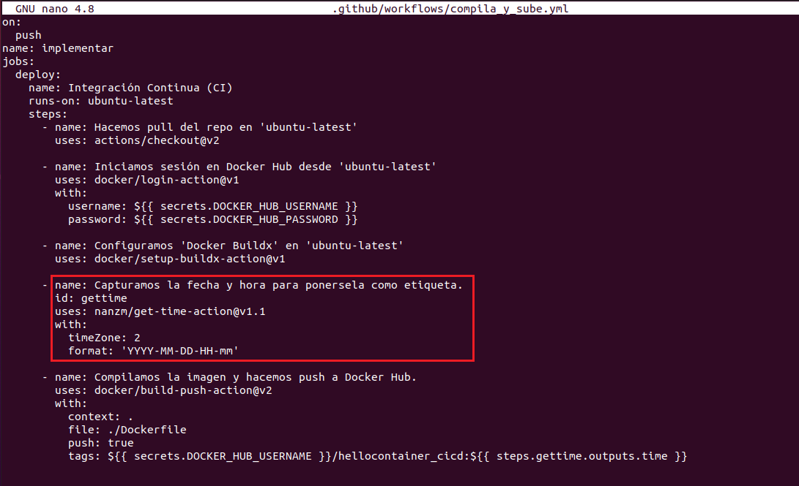
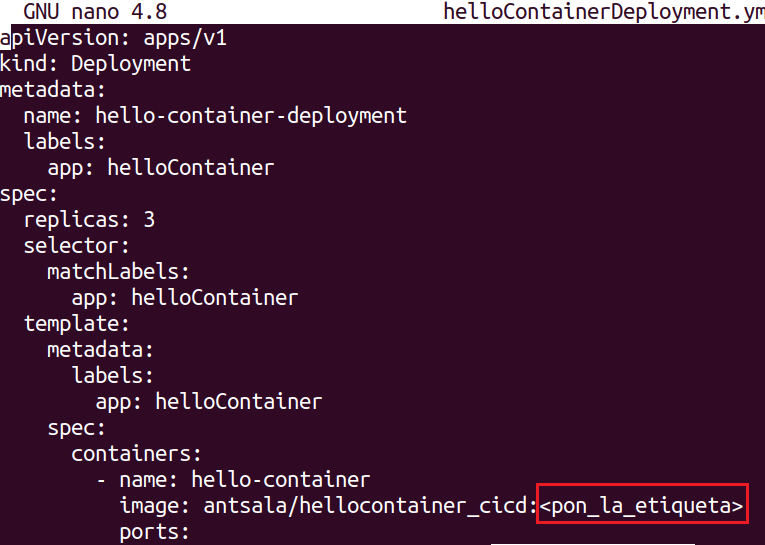

# CI-CD-Docker-GitHub-Actions-Kubernetes
Ejemplo de un CI/CD completo Github Actions.

Requisitos:

* Docker en la máquina local. 
* Un cluster de Kubernetes en el cloud.


Este tutorial realiza un recorrido completo para desplegar un CI/CD básico desde un Archivo Dockerfile hasta el despliegue del deployment correspondiente en Kubernetes.

Para facilitar la práctica, clonamos el directorio que contiene este documento y el resto de archivos que necesitarás para realizar la práctica.

En la terminal ejecuta.
```
cd ~

git clone https://github.com/antsala/CI-CD-Docker-GitHub-Actions-Kubernetes.git
```


## Ejercicio 1: Crear un repositorio nuevo en ***Github*** y clonarlo.

En ***GitHub*** creamos un repositorio llamado ***CI-CD-Test***.
Nota: El nombre del repositorio puedes cambiarlo a tu gusto.
Nota: Si ya has realizado este laboratorio antes, elimina el repo y vuelve a crearlo desde cero.

En la terminal vamos a clonar el repositorio remoto.
Nota. Tendrás que poner la URL correcta de tu repositorio.
```
cd ~

git clone https://github.com/antsala/CI-CD-Test.git
```

Entramos en el directorio que se acaba de crear.
```
cd CI-CD-Test
```

Vamos a copiar algunos archivos necesarios desde el repositorio ***CI-CD-Docker-GitHub-Actions-Kubernetes*** a este directorio.
```
cp -r ~/CI-CD-Docker-GitHub-Actions-Kubernetes/helloContainer/ .

cp ~/CI-CD-Docker-GitHub-Actions-Kubernetes/Dockerfile .
```

Como puedes ver en la siguiente imagen, tenemos el ***Dockerfile*** que genera la imagen. En la carpeta ***helloContainer*** está el código fuente de la aplicación.


Para poder ejecutar comandos ***Git*** debemos tener configurado el ***nombre de usuario*** y el ***email***.
```
git config --global user.name "<Por aqui tu nombre>"

git config --global user.email "<Por aqui tu email>"
```

Procedemos a agregar el archivo y la carpeta al ***staging***. En la terminal, escribimos.
```
git add Dockerfile

git add helloContainer
```

Comprobamos que todo es correcto.
```
git status
```

El resultado debe ser el siguiente.


Hacemos un commit.
```
git commit -m "Commit inicial"
```

Actualizamos el repositorio remoto. Desde el 13 de Agosto de 2021, ***GitHub*** ya no permite usar el password para autenticar las operaciones de ***git***. 

Debemos generar un ***PAT*** (Personal Access Token). Para ello, desde la página web de ***GitHub***, desplegamos el perfil y entramos en la opción ***Settings/Developer Settings/Personal Access Token/Generate New Token***.

Rellenamos el formulario.

* En ***Note*** escribimos un nombre que identifique la utilidad del ***token oauth*** que estamos creando.

* También debemos indicar el ámbito del acceso que estamos concediendo. Elegimos ***Full control of private repositories***, que nos permitirá el acceso a los archivos del repositorio.

* Y no debe olvidarse marcar ***workflow***, pues también tendremos que poder acceder a los archivos que definen las ***acciones de GitHub***. 

La imagen resume la configuración correcta.


Hacia la parte final de la página web encontraremos el botón ***Generate token***, en el que hacemos clic.

Copiamos el token de acceso en el portapapeles. Es importante tener en cuenta que ya no lo podremos visualizar más y, si lo perdemos, será necesario crear un ***PAT*** nuevo. Es una buena técnica almacenar este token en alguna aplicación que almacene passwords de forma segura para poder acceder a él cuando sea necesario.

En este laboratorio y por comodidad, indicaremos a ***git*** que cachee el password, para que así no tengamos que escribirlo más.
Nota: Es una mala práctica hacer esto en entornos de producción.

En la terminal escribimos el siguiente comando para cachear las contraseñas.
```
git config --global credential.helper cache
```

Ahora hacemos el ***push***. En la terminal escribimos.

```
git push
```

Nos pedirá el nombre de usuario de GitHub y como password, pegamos el que tenemos copiado en el portapapeles.

Ya tenemos el código fuente de la app y el Dockerfile para general la imagen en GitHub.


## Ejercicio 2: Contenerizar la aplicación.

La aplicación ***helloContainer*** levanta un servidor web en el puerto ***8080***. Cuando te conectas a él, responde mostrando en nombre de la máquina y las IPs que tiene configurada.

Vamos a abrir el archivo ***helloContainer.go*** que tiene el código fuente de la aplicación. Usa tu editor preferido (en este tutorial usamos ***nano***)
Nota: Para salir usa ***CTRL+X***.
```
nano helloContainer/helloContainer.go
```

De la misma forma, el ***Dockerfile***, compila el código fuente y genera una imagen que contiene el ejecutable. Lo repasamos.
```
nano Dockerfile
```

Cerramos el editor sin cambiar nada.

Hasta el momento, el workflow que hemos usado es siempre el mismo. Generaríamos la imagen con el comando ***docker build*** y la subiríamos a un repositorio como ***Docker Hub***. Posteriormente instruiríamos al cluster para que creara un contenedor, descargando la imagen desde el repositorio. 

Vamos a realizar todo el proceso, de forma automática, en el respositorio de ***GitHub***. Ni siquiera necesitaríamos tener ***Docker*** instalado.

## Ejercicio 3: Crear una Action en GitHub.

Para poder usar acciones en el repositorio necesitamos crear una ruta de directorios que deberá llamarse obligatoriamente ***.github/workflows***.
Nota: Observa que el directorio ***github*** es oculto por empezar por un punto.
```
mkdir -p ~/CI-CD-Test/.github/workflows
```

El el directorio anterior, creamos un archivo que definirá la acción de github. El nombre puede ser cualquiera, pero debe usar formato ***YAML***.
Nota: lo llamamos ***compila_y_sube.yml*** porque su finalidad es generar la imagen de contenedor y subirla a ***DockerHub***. 

Por comodidad, tenemos el archivo ya escrito, solo hay que copiarlo del otro repositorio con el siguiente comando.
```
cp ~/CI-CD-Docker-GitHub-Actions-Kubernetes/compila_y_sube.yml ~/CI-CD-Test/.github/workflows
```

```
nano ~/CI-CD-Test/.github/workflows/compila_y_sube.yml
```

Esta acción de GitHub hace lo siguiente.

Está a la espera de recibir el evento ***push*** (on push), que se produce cuando subimos al repositorio una actualización del código fuente (o del Dockerfile), por medio del comando ***git push***. Le hemos puesto el nombre ***implementar***.


La acción ***implementar*** estará formada por varios trabajos o ***jobs*** (En este ejemplo uno solo). Cada trabajo realizará una implementación o ***deploy***. A esta implementación la hemos llamado ***Integración Continua (CI)***. 

Cuando compilábamos la imagen de contenedor con ***Docker*** lo hacíamos en en nuestro propio equipo, porque es obvio que esta acción de compilar debe ejecutarse en alguna parte. Al movernos al ***GitHub***, nuestro equipo ya no participa en ello, y por consiguiente necesitamos "algo" que pueda ejecutar los pasos del deploy. Ese "algo" es un contenedor que nos proporciona ***GitHub*** de manera gratuita y corre en sus servidores. Nosotros solo debemos indicar la imagen que deseamos para dicho contenedor. En este ejemplo es ***ubuntu-latest***


El primer paso, que tiene como nombre ***Hacemos pull del repo en 'ubuntu-latest'***, descarga el código fuente de la aplicación y el Dockerfile en la máquina ***ubuntu-latest***. Para ello se usa la acción ***checkout@v2***.


***GitHub*** deberá logarse en ***DockerHub*** para hacer el push de la imagen, y para eso necesita credenciales. Esas credenciales las guardaremos como ***secretos de GitHub*** (los vamos a crear en breve). De esta forma, la acción es capaz de extraer el nombre de usuario y el password necesarios, consultando los secretos ***DOCKER_HUB_USERNAME*** y ***DOCKER_HUB_PASSWORD***.


Es el momento de pensar en compilar la imagen de contenedor. La acción utilizada es ***docker/setup-buildx-action@v1.1*** que prepara a ***ubuntu-latest*** para poder compilar imágenes.


Con cada nueva versión, necesitamos generar etiquetas diferentes (para que no se machaquen las previas). Hay muchas formas de hacer eso y en este ejemplo usamos la acción ***manzm/get-time-action@v1.1*** como ejemplo de uso de acciones escritas por usuarios de la comunidad.

Esta acción tiene el id ***gettime*** que será usado luego para recuperar el string que define la fecha y hora actuales.



Es el momento de hacer la compilación de la imagen. La siguiente acción que usa ***docker/build-push-action@v2*** compila y la sube a ***Docker Hub***. Como nombre de la imagen usamos el nombre del usuario, seguido del repositorio ***hellocontainer_cicd*** y la etiqueta se corresponde con la fecha de la compilación, tomada de la acción anterior.


## Ejercicio 4: Crear secretos en GitHub.

Los secretos almacenarán el nombre de usuario y la contraseña para poder logarse en ***Docker Hub***. Para ello, en la página web del repositorio ***CI-CD-Test*** hacemos clic en ***Settings***.

Luego, en el panel que aparece a la izquierdan seleccionamos ***Secrets/Actions***, y en la parte superior derecha, hacemos clic en el botón ***New repository secret***.


El secreto debe llamarse exactamente así: ***DOCKER_HUB_USERNAME*** y como valor escribe tu nombre de usuario de ***Docker Hub***. Hacemos clic en el botón ***Add secret***.


Realizamos el mismo procedimiento para el password. El secreto debe llamarse ***DOCKER_HUB_PASSWORD*** y debes poner tu contraseña de ***Docker Hub***.


## Ejercicio 5: Hacer push del código fuente.

Supongamos que acabamos de terminar la nueva versión de la aplicación. Con ***acciones de Github*** solo se necesita hacer un push de tu repositorio local para lanzar todo el proceso. 


Debemos "simular" que tenemos una versión nueva en el código fuente, de lo contrario el comando push indicará que no hay cambios.

Creamos un comentario en la primera línea poniendo la fecha y hora actuales. Guardamos.
Nota: Usa ***//*** para poner un comentario.
```
cd ~/CI-CD-Test

nano helloContainer/helloContainer.go
```

Añadimos al stage el archivo.
```
git add .github/workflows/compila_y_sube.yml
```

Hacemos el commit.
```
git commit -m "Nueva versión del dia <fecha>"
```

Hacemos el push, y eso iniciará todo el proceso.
```
git push
```

En la página web del repositorio ***CI-CD-Test*** hacemos clic en el botón ***Actions***, debemos ver como se ha capturado el evento push y se dispara el workflow.

En la imagen puedes ver como se ha iniciado el workflow.


Ya solo es cuestión de hacer clic en el flujo para ver qué está haciendo, si presenta errores o ha terminado correctamente.

En tu repositorio de ***Docker Hub*** verás la nueva imagen subida.


Con esto queda finalizada la parte de Integración Continua.

## Ejercicio 6: Despleglar el cluster de Kubernetes y crear un deployment de prueba.

Para desplegar el cluster en Azure, realizar el laboratorio https://github.com/antsala/k8s_desarrolladores/blob/main/00/lab-00.md


Copiamos los archivos yaml de la aplicación.
```
cp ~/CI-CD-Docker-GitHub-Actions-Kubernetes/*.yml ~/CI-CD-Test/

cd ~/CI-CD-Test
``` 

Editamos el archivo de deployment
```
nano helloContainerDeployment.yml
```

Debemos cambiar la imagen y poner la etiqueta correctamente. Para ello deberás comprobar la etiqueta de la última imagen generada en ***Docker Hub***.



Cuando lo hayas actualizado. Guarda el archivo.

Hacemos el deployment.
```
kubectl apply -f helloContainerDeployment.yml

kubectl apply -f helloContainerService.yml
```

Habilitamos el túnel de Minikube. En una nueva terminal escribimos.
```
minikube tunnel
```

Volvemos a la terminal anterior y escribimos.
```
kubectl get services
```

Mostramos el servicio y anotamos la ***EXTERNAL-IP***.
```
kubectl get service hello-container-service
```

Probamos que funciona.
```
curl <Pon_aqui_la_EXTERNAL-IP>
```

La salida debe ser similar a esta.


## Ejercicio 7: Despliegue continuo (CD)

Vamos a ampliar el archivo de workflow para que haga la implementación de la nueva versión de la aplicación en el cluster de Kubernetes. El repositorio local ya tiene este archivo. Lo abrimos para estudiarlo.
```
nano compila_sube_y_despliega.yml
```

El primer cambio es simple. Se ha cambiado el nombre del deploy a ***Integración y Despliegue Continuo (CI/CD)***.


La novedad viene en la parte del despliegue, a partir de la acción llamada ***Cambiamos la imagen de los contenedores***. Como podemos ver, hemos usado una acción escrita por el usuario ***steebchen***, que envía comandos a ***kubectl***.


Para que GitHub pueda controlar el cluster, es necesario pasar información de autenticación del cluster Minikube. Estos datos se guardarán como secreto.


